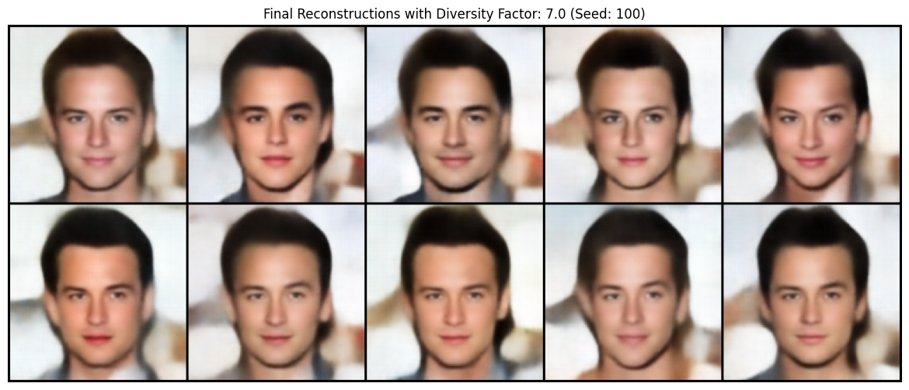

# Facial Image Generation with Variational Autoencoders (VAEs)

##  Project Overview

This project uses a pre-trained Variational Autoencoder (VAE) to generate diverse and consistent facial images from a single input.

It follows a this approach:

1. Generate multiple image variations using a standard VAE.
2. Experiment with a diversity_factor to control the creative output.
3. Identify the VAE's inherent weakness (image blurriness).
4. Introduce a state-of-the-art model (Stable Diffusion) to provide a comparative analysis and demonstrate a solution to this limitation.

A detailed methodology, analysis, and conclusions are documented in the report.

## Final Results: 10 Generated Images

### VAE Generations (Optimal Diversity)

The following grid was generated by the VAE after finding an optimal diversity factor of **7.0**.

### State-of-the-Art Comparison (Stable Diffusion)

A modern Diffusion Model was used to generate 10 variations. Note the significant improvement in image fidelity and sharpness.

##  How to Reproduce the Results

The entire project is contained within the GenCV00.ipynb notebook.

1. **Environment:** This notebook is designed to be run in a Google Colab environment.
2. **Execution:** Simply open GenCV00.ipynb in Colab and run the cells sequentially from top to bottom.
3. **Dependencies:** The notebook handles its own setup, including cloning the required VAE repository and installing necessary libraries.

The notebook will generate and display both sets of images as shown above.
